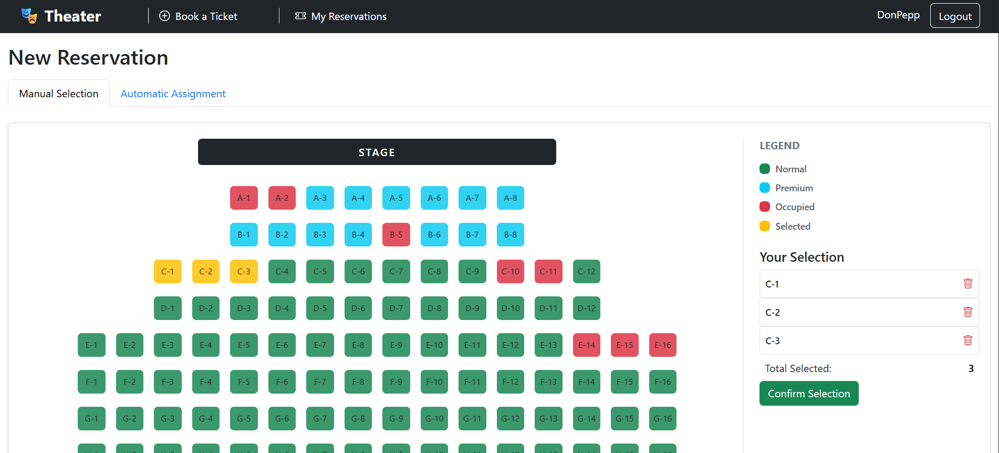

# Exam #1: "Theater"
## Student: s364243 Quaglia Giuseppe Pio 

## React Client Application Routes

- Route `/`: view of the map of the theater showing the current booking status, in only read mode.
- Route `/login`: login with credentials / TOTP
- Route `/booking`: to book new tickets (manual or automatic selection). Accessible only after logging in.
- Route `/reservations`: to manage reservations (personal reservations for users, all reservations for admins)
- Route `*`: Page for nonexisting URLs (Not Found page).

## API Server

* **GET `/api/seats`**: Get all theater seats with their category and current booking status.
  - **Response body**: JSON list of all seats:   
    ```
    [
      { "row": "A", "number": 1, "category": "premium", "status": "reserved" },
      { "row": "A", "number": 2, "category": "premium", "status": "free" }
    ]
    ```
  - Codes: `200 OK`, `500 Internal Server Error`.

* **GET `/api/reservations`**: Get the list of reservations (only owned reservations for normal users, all reservations for active admins).
  - **Response body**: JSON list of reservations and their assigned seats:   
    ```
    [
      {
        "id": 1,
        "userId": 2,
        "seats": [
          { "row": "C", "number": 10 },
          { "row": "C", "number": 11 }
        ]
      }
    ]
    ```
  - Codes: `200 OK`, `401 Unauthorized` (not authenticated), `500 Internal Server Error`.

* **POST `/api/reservations`**: Create a new reservation for the logged in user (manual or automatic assignment).
  - **Request**: JSON object specifying reservation type, and seats (if manual) or count/category (if automatic):   
    - *Manual*:
      ```json
      { "type": "manual",
        "seats": [ { "row": "A", "number": 3 } ]
      }
      ```
    - *Automatic*:
      ```json
      { "type": "automatic",
        "count": 2,
        "category": "normal"
      }
      ```
  - **Response body**: JSON object with success details:   
    ```
    { "message": "Reservation done",
      "reservationId": 5,
      "seats": [ { "row": "A", "number": 3 } ]
    }
    ```
  - Codes: `200 OK`, `401 Unauthorized`, `422 Unprocessable Entity` (invalid request body, not enough seats, seat not free, or seat released less than 40s ago), `500 Internal Server Error`.

* **PUT `/api/reservations/:id`**: Modify an existing reservation by adding and/or removing seats.
  - **Request**: JSON object with seats to add and/or remove:   
    ```
    { "add": [ { "row": "A", "number": 4 } ],
      "rem": [ { "row": "A", "number": 3 } ]
    }
    ```
  - **Response body**: JSON object with success details:   
    ```
    { "message": "Reservation updated" }
    ```
  - Codes: `200 OK`, `401 Unauthorized`, `404 Not Found` (reservation not found), `422 Unprocessable Entity` (seat not free, or seat released less than 40s ago), `500 Internal Server Error`.

* **DELETE `/api/reservations/:id`**: Delete an entire reservation and release its seats.
  - **Response body**: JSON object with success details:   
    ```
    { "message": "Reservation cancelled" }
    ```
  - Codes: `200 OK`, `401 Unauthorized` (not authenticated), `403 Forbidden` (trying to delete another user's reservation without active admin rights), `404 Not Found`, `500 Internal Server Error`.

  ### Authentication APIs 

* **POST `/api/sessions`**: Authenticate and login the user.
  - **Request**: JSON object with _username_ equal to email:   
    ```
    { "username": "u1@p.it", "password": "password" }
    ```
  - **Response body**: JSON object with the user's info:   
    ```
    { "id": 1, "username": "u1@p.it",
      "name": "Giuseppe",
      "is_admin": 1,
      "isActive": false 
    }
    ```
  - Codes: `200 OK`, `401 Unauthorized` (incorrect email and/or password), `500 Internal Server Error`.

* **GET `/api/sessions/current`**: Get info on the currently logged in user.
  - **Response body**: JSON object with user details:   
    ```
    { "id": 1,
      "username": "u1@p.it",
      "name": "Giuseppe",
      "is_admin": 1,
      "isActive": true
    }
    ```
  - Codes: `200 OK`, `401 Unauthorized` (not authenticated).

* **DELETE `/api/sessions/current`**: Logout the user.
  - Codes: `200 OK`.

* **POST `/api/login-totp`**: Perform the 2FA authentication using TOTP.
  - **Request**: JSON object with the verification code:   
    ```
    { "code": "123456" }
    ```
  - **Response body**: Fixed JSON object in case of success.
  - Codes: `200 OK`, `401 Unauthorized` (incorrect or expired code), `400 Bad Request` (TOTP not enabled for user), `503 Service Unavailable`.


## Database Tables

- Table `users` - Contains user credentails and user's roles.
   - Fields: `userId` (PK), `email`, `name`, `hash` (encrypted password), `salt`, `secret` (TOTP secret key), `is_admin`, `lastTotpStep`.

- Table `seats` - Contains theater seats' informations.
   - Fields: `row_label` (PK), `seatNumber` (PK), `category` (normal/premium).

- Table `reservations` - Contains created reservations.
   - Fields: `id` (PK), `userId` (FK).

- Table `seatsReserved` - Associate seats with reservations.
   - Fields: `row_label` (FK, PK), `seatNumber` (FK, PK),`reservationId` (FK), `userId` (FK).

- Table `seatsReleased` - Stores information about seats that have been released from a reservation (to manage 40s cool-down time).
   - Fields: `id` (PK), `userId` (FK), `row_label` (FK), `seatNumber` (FK), `dateDelete`.

## Main React Components

- `App` (in `App.jsx`): Principal component. It manages the global authentication state, application routes, and alerts.
- `GenericLayout` (in `components/Layout.jsx`): Common structure for pages (Navbar, conditional navigation links based on role and alert display).
- `LoginForm` & `TotpForm` (in `components/Auth.jsx`): Manage the login forms, respectively (with 2FA TOTP for admins).
- `Homepage` (in `components/Homepage.jsx`): Main screen for visitors, shows the current state of the theater in read-only mode.
- `Reservations` (in `components/Reservations.jsx`): Screen for displaying active reservations with buttons to view them on the map, edit, or cancel them.
- `TicketLayout` (in `components/TicketLayout.jsx`): Ticket booking screen, with a tab for manual seat selection and a form for automatic assignment.
- `TheaterMap` (in `components/SeatLayout.jsx`): Graphical theater seats grid. It makes seats interactive, colored according to the status and highlights the current selections.

## Screenshot



## Users Credentials

| email | password | name | is_admin |
|-------|----------|------|-------------|
| u1@p.it | pwd | Giuseppe | 1 |
| u2@p.it | pwd | DonPepp | 0 |
| u3@p.it | pwd | Antonio | 1 |
| u4@p.it | pwd | Carmen | 0 |

